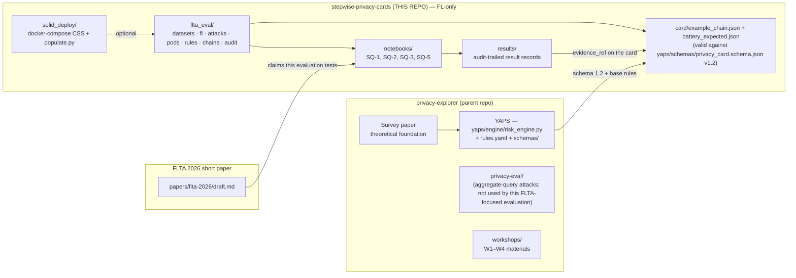
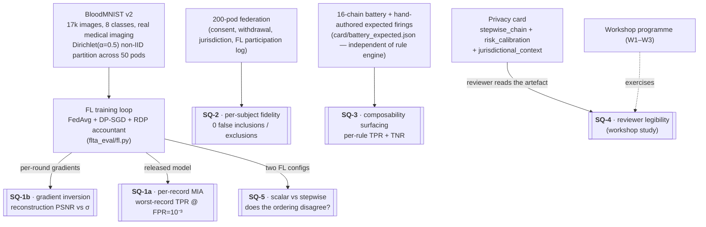
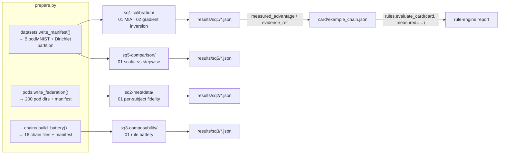

# Methodology — FLTA 2026 evaluation companion artefact

Federated-learning-only methodology. The structure follows NIST SP 800-188 [1] and SP 800-226 (draft) [2] for disclosure categorisation, Carlini *et al.* (S&P 2022) [3] for per-record auditing, and Hatamizadeh *et al.* (CVPR 2023) [4] + Boenisch *et al.* (USENIX Security 2023) [5] for the gradient-inversion thresholding.

The methodology covers four notebook-based study questions (SQ-1 calibration, SQ-2 metadata, SQ-3 composability, SQ-5 scalar-vs-stepwise). SQ-4 (reviewer legibility) is a workshop study.

---

## 0. Visual overview

### 0.1 Where this evaluation sits

### 0.2 The five study questions in one picture

### 0.3 End-to-end data flow

The same loop is exercised in workshops W2 (card construction) and W3 (sectoral deepening).

---

## 1. Study questions and success criteria

### SQ-1 — Calibration soundness (two attacks)

**Claim.** Do measured attack rates against the FL pipeline agree with the card's declared `attack_target.target_advantage`, within tolerance?

**Attacks.**
- *Per-record MIA* against the FL-released model [3]: worst-record TPR @ FPR=10⁻³ across a stratified target sweep.
- *Gradient inversion* against per-round client updates [Geiping, Zhu]: reconstruction PSNR as a function of σ.

**Success criteria.**
- Worst-record TPR @ FPR=10⁻³ agrees with the card's `target_advantage` to within ±0.01 absolute *at paper scale* (`PAPER_SCALE = True`, n_targets=60, n_shadow_runs=128). Tutorial scale is high-variance and not bound by tolerance — the methodology is what tutorial scale tests.
- Gradient inversion median PSNR is below the 15 dB recognisability threshold for σ at or above the configured DP noise multiplier of the card (1.1, corresponding to ε ≈ 2 in the example card).
- All metrics reproducible bit-for-bit at fixed seed.

### SQ-2 — Per-subject metadata fidelity

**Claim.** Does the rule engine include and exclude data subjects correctly on the basis of pod-resident metadata?

**Success criteria.**
- Zero false inclusions on the 100-pod negative set.
- Zero false exclusions on the 100-pod positive set.
- Exact firing-set match against `pods/_manifest.json` per-pod expected entries.

### SQ-3 — Composability surfacing

**Claim.** Do the FLTA composability rules fire on mis-configured chains and stay silent on well-configured ones, *against a manifest authored independently from the rule engine*?

The expected firings live in [`card/battery_expected.json`](card/battery_expected.json) — hand-authored. This avoids the "rule engine agrees with itself" critique.

**Success criteria.** TPR and TNR equal 1.0 for each of the four composability rules.

### SQ-5 — Scalar (ε, AUROC) vs stepwise card

**Claim.** Does the calibrated stepwise card surface information that scalar (ε, AUROC) reporting does not? In particular, does the *ordering* of FL configurations by ε match the *ordering* by empirical worst-record TPR?

**Success criteria.** Qualitative — the comparison is informative if at least one of:
- The two orderings disagree (calibration surfaces re-ordering due to clipping × non-IID interactions), or
- The orderings agree but the calibrated report adds per-record tail information not present in the scalar form.

The current configuration produces *disagreeing* orderings (see [`results/sq5/`](results/sq5/) for the recorded values).

---

## 2. Dataset — BloodMNIST

See README §2. Citations: Yang *et al.* (*Sci. Data* 2023); underlying dataset: Acevedo *et al.* (*Data in Brief* 2020).

### Dirichlet partitioning

Per Hsu *et al.* 2019 [6]: for each class c, draw a Dirichlet(α=0.5) proportions vector over pods and assign that class's samples accordingly. α=0.5 is the standard moderate non-IID setting; lower α is more non-IID. The partition is recorded in `data/_manifest.json` (with `pod_class_distribution` for inspection).

### What is deliberately not used

- No synthetic-NHANES-like data. The earlier draft used a lognormal generator calibrated to published NHANES BMI moments; that has been replaced with the real BloodMNIST dataset.
- No three-UK-plus-one-EU institutional setup. The scenario is now cross-device FL across EU data subjects under a single regulatory regime (GDPR Art. 6(1)(a) consent + Art. 9(2)(j) research; EU AI Act limited-risk transparency obligations). The cross-jurisdictional rule (`COMP-JURIS-001`) is exercised by *varying the operator jurisdiction* in the SQ-3 battery, not by hard-coding a multi-jurisdictional scenario.

---

## 3. FL pipeline

The training loop ([`flta_eval/fl.py`](flta_eval/fl.py)) is a pure-numpy FedAvg implementation with DP-SGD-style per-update clipping + Gaussian noise. Choice rationale: tractable to read, no PyTorch dependency, deterministic from a seed; sufficient for the demonstrations the paper makes.

| Component | Source |
|---|---|
| FedAvg aggregation | McMahan *et al.*, AISTATS 2017 |
| DP-SGD clipping + noise | Abadi *et al.*, ACM CCS 2016 |
| RDP accountant (single-α envelope) | Mironov, IEEE CSF 2017 |
| Gradient inversion (cosine-similarity, label-known) | Geiping *et al.*, NeurIPS 2020; Zhu *et al.*, NeurIPS 2019 |

For production use, swap in Flower + Opacus; the harness is structured so the swap is one module replacement, not a refactor.

---

## 4. Threat profiles

Three profiles, FL-specific:

- **R — semi-honest result consumer.** Observes the FL-released model only. Used by per-record MIA.
- **A — budget-bounded motivated intruder.** Queries the released model with bounded auxiliary data. (Not currently exercised by an attack; reserved for a future linkage extension.)
- **I — authorised federation collaborator.** Observes per-round gradient updates before the TEE-internal aggregation. Used by gradient inversion.

Full capability matrix in [`THREAT_MODEL.md`](THREAT_MODEL.md).

---

## 5. Metrics

| Metric | Definition | Source | Used for |
|---|---|---|---|
| AUROC | Test-set accuracy / area under ROC | Standard | FL utility |
| TPR @ FPR=10⁻³ | True-positive rate at fixed FPR threshold | [3] | MIA per-record sweep |
| Worst-record TPR @ FPR=10⁻³ | Max across the per-record sweep | [3] | SQ-1 headline; binding |
| Reconstruction PSNR (dB) | 10·log₁₀(1/MSE) between reconstructed and true input | Geiping; Zhu | Gradient inversion |
| Cosine distance | 1 - cos(g_target, g_reconstructed) | Geiping | Gradient inversion (diagnostic) |
| Per-subject inclusion accuracy | Rule engine inclusion vs expected | This work | SQ-2 |
| Composability rule fire-rate | Per-rule TP / FN / FP / TN | This work | SQ-3 |
| Scalar-empirical ordering agreement | Boolean over FL configs | This work | SQ-5 |

---

## 6. Audit-trail discipline

Every result record carries: harness commit hash, dataset SHA-256, configuration hash, seed namespace, timestamp. A result is reproducible from the record alone when re-running the harness at the recorded commit with the recorded dataset, configuration, and seed yields the metric to the stated tolerance.

---

## 7. Robustness and known limitations

Stated explicitly:

- **Numpy MLP, not production FL framework.** The training loop reads cleanly but is not Flower/TFF-grade. Choice for reproducibility; swap is a future-iteration item.
- **RDP accountant is conservative.** A single-α envelope is used in `fl.rdp_epsilon`; production deployments should use `opacus.accountants.RDPAccountant` for tighter bounds.
- **Gradient inversion against MLP only.** Single-sample inversion against a 2-layer MLP is the cleanest demonstration setting [Geiping §3]. Larger batches + richer architectures (CNNs, transformers) demand stronger priors [Yin *et al.* 2021] and are out of scope here.
- **Tutorial-scale MIA is noisy.** Worst-record max over 8 targets is high-variance; the calibration headline at tutorial scale should not be expected to match the card's declared target. Paper scale (60 × 128) is the calibrated configuration.
- **Solid runtime path optional.** The default evaluation runs against on-disk JSON-LD. The Solid deployment package in [`solid_deploy/`](solid_deploy/) exercises a real CSS instance but is not part of `make eval` — see [`solid_deploy/README.md`](solid_deploy/README.md).
- **No adversarial-server attack.** The threat profiles are honest-but-curious and budget-bounded; adversarial-server attacks [Boenisch 2023, §5] are out of scope. The COMP-GRADINV-001 threshold is *conservative* for the honest-but-curious profile.

---

## 8. References (this companion artefact)

[1] NIST SP 800-188, "De-identifying personal information," 2023.
[2] NIST SP 800-226 (draft), "Guidelines for evaluating differential privacy guarantees," 2023.
[3] N. Carlini *et al.*, "Membership inference attacks from first principles," *IEEE S&P*, 2022.
[4] A. Hatamizadeh *et al.*, "Do gradient inversion attacks make federated learning unsafe?," *CVPR*, 2023.
[5] F. Boenisch *et al.*, "When the curious abandon honesty: federated learning is not private," *USENIX Security*, 2023.
[6] T.-M. H. Hsu, H. Qi, M. Brown, "Measuring the effects of non-identical data distribution for federated visual classification," 2019. arXiv:1909.06335.
[7] J. Yang *et al.*, "MedMNIST v2 — a large-scale lightweight benchmark for 2D and 3D biomedical image classification," *Sci. Data* 10:41, 2023.
[8] B. McMahan *et al.*, "Communication-efficient learning of deep networks from decentralized data," *AISTATS*, 2017.
[9] M. Abadi *et al.*, "Deep learning with differential privacy," *ACM CCS*, 2016.
[10] I. Mironov, "Rényi differential privacy," *IEEE CSF*, 2017.
[11] J. Geiping *et al.*, "Inverting gradients — how easy is it to break privacy in federated learning?," *NeurIPS*, 2020.
[12] L. Zhu *et al.*, "Deep leakage from gradients," *NeurIPS*, 2019.
[13] H. Yin *et al.*, "See through gradients: image batch recovery via GradInversion," *CVPR*, 2021.
[14] D. Pasquini, D. Francati, G. Ateniese, "Eluding secure aggregation in federated learning via model inconsistency," *ACM CCS*, 2022.
