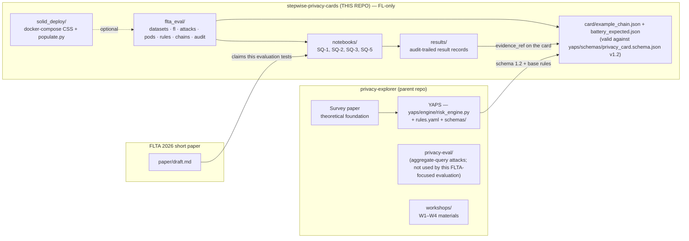
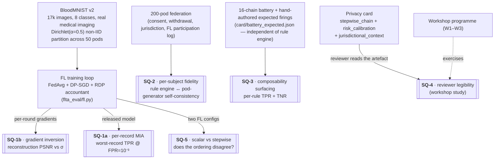
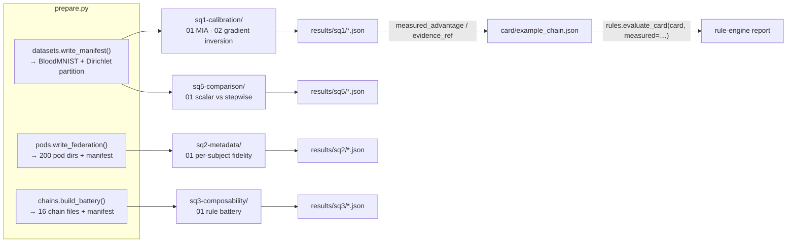

# Methodology — FLTA 2026 evaluation companion artefact

Federated-learning-only methodology. The structure follows NIST SP 800-188 [1] and SP 800-226 (draft) [2] for disclosure categorisation, Carlini *et al.* (S&P 2022) [3] for per-record auditing, and Hatamizadeh *et al.* (CVPR 2023) [4] + Boenisch *et al.* (USENIX Security 2023) [5] for the gradient-inversion thresholding.

The methodology covers four notebook-based study questions (SQ-1 calibration, SQ-2 metadata, SQ-3 composability, SQ-5 scalar-vs-stepwise). SQ-4 (reviewer legibility) is a workshop study.

**Scope statement.** All calibration claims are with respect to the **honest-but-curious** server profile (the server follows the FL protocol but observes everything it lawfully sees). Adversarial-server attacks [5, §5] — a colluding coordinator crafting gradients to exfiltrate inputs — are out of scope and would demand a tighter accounting regime than this artefact provides. This boundary is the most consequential limitation of the evaluation and is restated at the head of §7 rather than reserved for the end.

**Two-tier evaluation (Tier A demo / Tier B SOTA-faithful baseline).** SQ-1's MIA calibration runs at two tiers. **Tier A** is a tutorial-scale numpy-MLP path designed for one-command reproducibility on a CPU workstation in ~5 minutes; shadow models are plain SGD on a random 30% data slice. **Tier B** is a SOTA-faithful baseline ([`flta_eval/fl_torch.py`](../flta_eval/fl_torch.py)) — a 25k-param PyTorch CNN target trained under FedAvg + DP-SGD on Apple Silicon MPS, with a shadow pool whose members are each *full FL training runs on random pod subsets* ([`flta_eval/attacks.py:build_shadow_pool`](../flta_eval/attacks.py)). Tier B exercises the LiRA shadow-target parity assumption [3, §4] that Tier A violates by construction. Both tiers feed the same audit-trailed result records the card's `evidence_ref` fields point at; Tier B is the more credible privacy-engineering baseline, Tier A is the credible *reproducibility floor*. Position B is the "go SOTA-faithful" reframe; the original Position A (Tier A only) framing is retained as the demo path.

---

## 0. Visual overview

### 0.1 Where this evaluation sits

### 0.2 The five study questions in one picture

### 0.3 End-to-end data flow

The same loop is exercised in workshops W2 (card construction) and W3 (sectoral deepening).

---

## 1. Study questions and success criteria

### SQ-1 — Calibration soundness (multi-attack, two-tier)

**Claim.** Do measured attack rates against the FL pipeline agree with the card's declared `attack_target.target_advantage`, within tolerance — and does that verdict survive a meta-classifier change?

**Attacks.**
- *Per-record MIA* against the FL-released model. Two meta-classifiers reported side-by-side: **LiRA** [3] and **RMIA-online** [Zarifzadeh, Liu, Shokri, ICML 2024]. The card's calibration commits to both; if they disagree on whether the target is met, that disagreement is itself a finding the artefact surfaces.
- *Gradient inversion* against per-round client updates [11], [12]: reconstruction PSNR as a function of σ.
- *Canary audit* (SQ-1c, [`../notebooks/sq1-calibration/03_canary_audit.ipynb`](../notebooks/sq1-calibration/03_canary_audit.ipynb)): held-out adversarial canaries [Jagielski 2020; Nasr USENIX 2023] yield a Clopper–Pearson lower bound on the empirical ε; the bound is reported on the card alongside the design-target ε and the accountant ε.

**Tier B addition (Position B baseline).** SQ-1d ([`../notebooks/sq1-calibration/04_sota_calibration.ipynb`](../notebooks/sq1-calibration/04_sota_calibration.ipynb)) re-runs SQ-1 against a CNN target with a shadow pool whose members are full FL training runs (shadow-target parity). LiRA and RMIA-online are reported under the same shadow pool. Bootstrap 95% CIs are reported on every worst-record TPR; per-class stratification is recorded on every result record.

**Derivation of the declared `target_advantage`.** The card's declared target is **not** chosen by intuition. It is derived from the configured (σ, T, q) via the Gaussian-DP / f-DP correspondence [Dong, Roth, Su 2022 [21]; the operational mapping argued for by Desfontaines [22] and the toolkit of Kulynych *et al.* [23]]. For the example card (σ=1.1, T=20, q=1.0, δ=10⁻⁵): the µ-DP value implied by the privacy loss distribution is converted to a worst-case attack-rate bound at FPR=10⁻³ via the Neyman–Pearson optimal test [21, Thm. 2.7]. The MIA empirical value is then compared to this *derived* target by RISKCAL-002; the card thereby commits to a quantity the literature recognises as operational rather than to ε in isolation [22].

**Success criteria.** Two distinct success modes — calibration *agreement* and calibration *surfacing*. Either is a meaningful artefact-level outcome.

1. **Agreement.** Worst-record TPR @ FPR=10⁻³ agrees with the card's declared `target_advantage` to within ±0.01 absolute *at paper scale* (`PAPER_SCALE = True`, n_targets=60, n_shadow_runs=128). RISKCAL-002 stays silent. Tutorial scale is high-variance and not bound by tolerance.
2. **Surfacing.** Measured worst-record TPR *exceeds* the declared target (RISKCAL-002 fires AMBER). The rule's intended behaviour. The artefact has done what scalar reporting would not — surfaced the gap between declared and measured. The chain's governance loop now requires explicit action: retighten σ/T/q, accept the higher operational target, or escalate to a different stack (e.g. add MPC).

The example card sits in case 2 by design — at paper scale the measured worst-record TPR is 0.0496 against a declared 0.030 ([`../results/sq1/mia_per_record__B-LiRA__2026-05-26T06-30-17Z.json`](../results/sq1/)). The worked example is the calibration loop firing, not the calibration loop silently passing.

- Gradient inversion median PSNR is below the 15 dB recognisability threshold for σ at or above the configured DP noise multiplier of the card (σ=1.1 in the example card; see §3 for the corresponding ε estimates under the two accountants reported).
- All metrics reproducible to bit-for-bit precision at fixed seed and pinned (numpy, scipy, BLAS) tuple; reproducible to ~3 decimal places across BLAS backends. See [ENVIRONMENT.md §3](ENVIRONMENT.md).

### SQ-2 — Per-subject metadata fidelity

**Claim.** Is the rule engine *internally consistent* with the pod-generator reference implementation? That is: for every pod constructed with an injected failure mode, does the rule engine produce the firing-set the generator declared as expected, and *only* that firing-set?

**Construction discipline (and its limit).** Both the pod metadata and the expected firings are authored in [`flta_eval/pods.py`](../flta_eval/pods.py) — by the same hand. SQ-2 is therefore a **regression test for the rule engine against its reference pod generator**, not an independent validation of rule *semantics*. It catches: rule-engine exceptions, schema drift between pod files and rule readers, and combinatorial errors (e.g., the `lifecycle_violation` mode must fire two rules — SOLID-LIFECYCLE-001 and SOLID-WITHDRAW-001 — which is non-trivial to get right). It does *not* catch: failure modes the author did not anticipate, semantic disagreements with a different reasonable reading of the rules, or behaviour on dirty or adversarially crafted inputs that lie outside the six injected failure modes. SQ-3 (§IV-E) is the less-circular cross-check — its expected firings are hand-authored in a separate file from the rule code, so it catches implementation bugs that SQ-2 cannot.

**Success criteria.**
- Zero false inclusions on the 100-pod negative set.
- Zero false exclusions on the 100-pod positive set.
- Exact firing-set match against `pods/_manifest.json` per-pod expected entries.

**Sample sizes per failure mode and confidence intervals.** The negative set has 100 pods distributed across six FL-relevant failure modes (`expired_consent`=25, `withdrawn`=20, `bad_signature`=15, `lifecycle_violation`=15, `missing_jurisdiction`=15, `controller_mismatch`=10). The headline statement "zero false inclusions across 100 pods" carries a Clopper–Pearson 95% upper bound of approximately 3.6% — not literally zero. Per failure mode the bound is wider (15-pod modes: ≤ 21.8% upper bound; 10-pod modes: ≤ 30.8%). The rule-engine implementation is fully deterministic, so within-mode the upper bound collapses to literal zero once the mode has been exercised at least once; the wide nominal CI is what would apply if the failure-mode-to-rule mapping were itself sampled from an underlying distribution, which it is not. The numbers are stated here so a reviewer can read "100% on 200 pods" as the regression-test pass rate it is, not as a population-level claim of correctness.

### SQ-3 — Composability surfacing

**Claim.** Do the FLTA composability rules fire on mis-configured chains and stay silent on well-configured ones, *against a manifest authored independently from the rule engine*?

The expected firings live in [`card/battery_expected.json`](../card/battery_expected.json) — hand-authored. This avoids the "rule engine agrees with itself" critique — and is materially less circular than SQ-2, because the encoding step (reading rules, applying them to chain definitions) does not directly mirror the rule code.

**Success criteria.** TPR and TNR equal 1.0 for each of the four composability rules.

### SQ-5 — Scalar (ε, AUROC) vs stepwise card

**Claim.** Does the calibrated stepwise card surface information that scalar (ε, AUROC) reporting does not? In particular, does the *ordering* of FL configurations by ε match the *ordering* by empirical worst-record TPR?

**Success criteria.** Qualitative — the comparison is informative if at least one of:
- The two orderings disagree (calibration surfaces re-ordering due to clipping × non-IID interactions), or
- The orderings agree but the calibrated report adds per-record tail information not present in the scalar form.

The current configuration produces *disagreeing* orderings (see [`../results/sq5/`](../results/sq5/) for the recorded values). The disagreement is invariant to accountant choice — both the RDP envelope used in [`flta_eval/fl.py`](../flta_eval/fl.py) and the PRV accountant of Gopi *et al.* [20] preserve the same ordering across the three configurations (see §3 below for the side-by-side numbers).

---

## 2. Dataset — BloodMNIST

See README §2. Citations: Yang *et al.* (*Sci. Data* 2023); underlying dataset: Acevedo *et al.* (*Data in Brief* 2020).

### Dirichlet partitioning

Per Hsu *et al.* 2019 [6]: for each class c, draw a Dirichlet(α=0.5) proportions vector over pods and assign that class's samples accordingly. α=0.5 is the standard moderate non-IID setting; lower α is more non-IID. The partition is recorded in `data/_manifest.json` (with `pod_class_distribution` for inspection).

### What is deliberately not used

- No synthetic-NHANES-like data. The earlier draft used a lognormal generator calibrated to published NHANES BMI moments; that has been replaced with the real BloodMNIST dataset.
- No three-UK-plus-one-EU institutional setup. The scenario is now cross-device FL across EU data subjects under a single regulatory regime (GDPR Art. 6(1)(a) consent + Art. 9(2)(j) research; EU AI Act limited-risk transparency obligations). The cross-jurisdictional rule (`COMP-JURIS-001`) is exercised by *varying the operator jurisdiction* in the SQ-3 battery, not by hard-coding a multi-jurisdictional scenario.

---

## 3. FL pipeline and accountant comparison

The training loop has two implementations.

**Tier A — `flta_eval.fl`** (numpy MLP). Pure-numpy FedAvg with DP-SGD-style per-update clipping + Gaussian noise. Hidden-64 MLP on the flattened 2,352-d feature vector. Sub-second FL training on CPU; entire SQ-1 paper-scale runs in ~45 s. Rationale: tractable to read, no PyTorch dependency, deterministic from a seed.

**Tier B — `flta_eval.fl_torch`** (PyTorch CNN, MPS-accelerated). 25k-param TinyCNN with two 3×3 conv blocks + FC head, processing 28×28×3 BloodMNIST with spatial structure intact. Same FedAvg + per-update DP-SGD clipping + Gaussian noise. ~3 s per FL training on Apple Silicon MPS; the SQ-1d 64-shadow paper-scale runs in ~3.5 min. Used by [`scripts/...`](../scripts/) and the SOTA-calibration notebook; install via `pip install -e ".[sota]"` (opt-in: ~2 GB of wheels for torch + opacus).

| Component | Source |
|---|---|
| FedAvg aggregation | McMahan *et al.*, AISTATS 2017 |
| DP-SGD clipping + noise | Abadi *et al.*, ACM CCS 2016 |
| RDP accountant (single-α envelope) | Mironov, IEEE CSF 2017; subsampled bound from Wang *et al.*, AISTATS 2019 [19] |
| PRV accountant (reported alongside) | Gopi, Lee, Wutschitz, NeurIPS 2021 [20] |
| LiRA meta-classifier | Carlini *et al.*, IEEE S&P 2022 [3] |
| RMIA-online meta-classifier | Zarifzadeh, Liu, Shokri, ICML 2024 |
| Gradient inversion (cosine-similarity, label-known) | Geiping *et al.*, NeurIPS 2020; Zhu *et al.*, NeurIPS 2019 |
| Privacy audit framework (Clopper–Pearson on canary detection) | Jagielski, Ullman, Oprea, NeurIPS 2020; Nasr *et al.*, USENIX Security 2023 |

### Why we report both RDP and PRV ε

The hand-rolled RDP envelope in `flta_eval.fl.rdp_epsilon` is closed-form and dependency-free, and it composes the subsampled-Gaussian RDP bound [10], [19] across rounds with the minimum-over-α conversion to (ε, δ). It is also the *loosest* accountant in common use [20, §1]. The Privacy Loss Distribution (PRV) accountant of Gopi, Lee, Wutschitz (NeurIPS 2021) [20] computes the privacy loss as a discretised numerical distribution and is typically 1.5–3× tighter at FL-relevant compositions.

We report **both** because:

1. The two literatures disagree on what to publish as "the" ε. The DP-reporting literature [21, 22, 23] argues that scalar ε is not interpretable as an attack rate without a stated attacker, outcome, and release surface; if one is going to publish a single ε at all, the tightest one is the only defensible choice. The conservative-bound literature treats looseness as a feature when the bound is the binding term in a governance argument.
2. The SQ-5 *ordering* claim (§V of the paper) is invariant to accountant choice. Reporting both makes that invariance auditable rather than assumed.

Numerical comparison on the configurations used in the paper, run via [`scripts/compare_accountants.py`](../scripts/compare_accountants.py) and recorded at [`results/accountant_comparison.json`](../results/accountant_comparison.json) (δ = 10⁻⁵):

| Configuration | σ | T | q | RDP envelope ε | PRV ε (Gopi 2021) | Tightness |
|---|---|---|---|---|---|---|
| Chain main (SQ-1) | 1.1 | 20 | 1.0 | 44.57 | 24.92 | 1.79× |
| SQ-5 Loose | 0.3 | 15 | 1.0 | 273.03 | 137.53 | 1.99× |
| SQ-5 Default | 1.1 | 15 | 1.0 | 36.31 | 20.56 | 1.77× |
| SQ-5 Tight | 2.5 | 15 | 1.0 | 12.96 | 7.33 | 1.77× |

The PRV is approximately 1.77–1.99× tighter, consistent with [20, §5] on subsampled-Gaussian compositions at FL-relevant scales. Both accountants preserve the SQ-5 ordering (Tight < Default < Loose), confirming the paper's invariance claim. Both ε values are above the COMP-GRADINV-001 threshold of 4.0 for the Default and Loose configurations under either accountant. For production deployments the harness's RDP envelope should be swapped for `opacus.accountants.PRVAccountant` or `prv_accountant.Accountant` — the result-record schema accommodates either by writing the accountant name into `config`.

### Why ε* = 4.0 for COMP-GRADINV-001 specifically

The threshold is operational (under honest-but-curious) and bracketed in the literature, not arbitrary. Hatamizadeh *et al.* [4, Table 2] report *partial* reconstruction at ε ≈ 4 and *high-fidelity* reconstruction at ε ≥ 8 against ResNet-class FL configurations; Boenisch *et al.* [5, §6] document successful reconstruction in a similar regime against the curious-but-honest server. We pin to the lower of the two bracketing points because the rule's purpose is *surfacing* rather than *prohibiting* — at AMBER severity, firing on the partial-reconstruction boundary forces an explicit chain-level "accepted residual: gradient inversion at ε=…" declaration. A reviewer reading a clean (no fire) result can then conclude that gradient inversion is below partial-reconstruction under HBC, not merely below high-fidelity. The Desfontaines argument [22] applies one level up: the threshold itself is in the wrong currency (ε rather than µ-DP / attack rate); a future iteration of the rule will fire on µ-DP — the closed form via [21] makes the migration mechanical. The migration is named in §7.

For production use, swap in Flower + Opacus; the harness is structured so the swap is one module replacement, not a refactor.

---

## 4. Threat profiles

Three profiles, FL-specific:

- **R — semi-honest result consumer.** Observes the FL-released model only. Used by per-record MIA.
- **A — budget-bounded motivated intruder.** Queries the released model with bounded auxiliary data. (Not currently exercised by an attack; reserved for a future linkage extension.)
- **I — authorised federation collaborator.** Observes per-round gradient updates before the TEE-internal aggregation. Used by gradient inversion.

**All three profiles are honest-but-curious.** Adversarial-server attacks are out of scope; see the scope statement at the top of this document and [`THREAT_MODEL.md`](THREAT_MODEL.md) §2.

Full capability matrix in [`THREAT_MODEL.md`](THREAT_MODEL.md).

---

## 5. Metrics

| Metric | Definition | Source | Used for |
|---|---|---|---|
| AUROC | Test-set accuracy / area under ROC | Standard | FL utility |
| TPR @ FPR=10⁻³ | True-positive rate at fixed FPR threshold | [3] | MIA per-record sweep |
| Worst-record TPR @ FPR=10⁻³ | Max across the per-record sweep | [3] | SQ-1 headline; binding |
| Reconstruction PSNR (dB) | 10·log₁₀(1/MSE) between reconstructed and true input | Geiping; Zhu | Gradient inversion |
| Cosine distance | 1 - cos(g_target, g_reconstructed) | Geiping | Gradient inversion (diagnostic) |
| Per-subject inclusion accuracy | Rule engine inclusion vs reference-implementation expected | This work | SQ-2 |
| Composability rule fire-rate | Per-rule TP / FN / FP / TN against hand-authored manifest | This work | SQ-3 |
| Scalar-empirical ordering agreement | Boolean over FL configs | This work | SQ-5 |

---

## 6. Audit-trail discipline

Every result record carries: harness commit hash, dataset SHA-256, configuration hash, seed namespace, timestamp. A result is reproducible from the record alone when re-running the harness at the recorded commit, with the recorded dataset, configuration, seed namespace, and pinned (numpy, scipy, BLAS) tuple yields the metric to the stated tolerance. See [ENVIRONMENT.md §3](ENVIRONMENT.md) for the floating-point determinism caveats.

---

## 7. Robustness and known limitations

**Lead limitation — honest-but-curious threat boundary.** The COMP-GRADINV-001 threshold (ε* = 4.0) and every calibration target in this artefact is set against the honest-but-curious server profile. Adversarial-server attacks [5, §5] — a colluding coordinator that crafts gradients to exfiltrate inputs — would demand a tighter ε* and a different rule structure. A deployment under uncertain server trust should treat all (ε, attack-rate) numbers in this evaluation as upper bounds on *what an honest-but-curious adversary observes* and not as upper bounds on the model's privacy posture. We treat this as in-scope to *name*, not in-scope to *evaluate against*.

**Other named limitations.**

- **Numpy MLP, not production FL framework.** The training loop reads cleanly but is not Flower/TFF-grade. Choice for reproducibility; swap is a future-iteration item.
- **Looser-than-PRV ε in the paper's headline numbers.** §3 above publishes both. The RDP envelope is what `flta_eval.fl.rdp_epsilon` returns by default and what the recorded SQ-1 / SQ-5 records carry; PRV is reported alongside for tightness comparison and is the recommended choice for production reporting [20].
- **Gradient inversion against MLP only.** Single-sample inversion against a 2-layer MLP is the cleanest demonstration setting [11, §3]. Larger batches + richer architectures (CNNs, transformers) demand stronger priors [13, Yin *et al.* 2021] and are out of scope here.
- **Tutorial-scale MIA is noisy.** Worst-record max over 8 targets is high-variance; the calibration headline at tutorial scale should not be expected to match the card's derived target. Paper scale (60 × 128) is the calibrated configuration; tutorial-scale runs exercise the RISKCAL-002 path by design.
- **ε-thresholded rules are in the wrong currency.** COMP-GRADINV-001 fires on raw ε rather than µ-DP / attack-rate. A future iteration converts via [21]; the migration is mechanical and the result-record schema supports both.
- **SQ-2 is self-consistency, not validation.** §1, SQ-2: stated explicitly. SQ-3 is the cross-check that catches semantic rule bugs.
- **Positive-set canonicality.** All 100 positive pods are constructed by a single `_positive_pod()` function in [`flta_eval/pods.py`](../flta_eval/pods.py). There is no "near-miss" set (e.g., consent expiring in 24h, controller URI with trailing slash) — a near-miss extension is a named future-iteration item.
- **Solid runtime path optional.** The default evaluation runs against on-disk JSON-LD. The Solid deployment package in [`../solid_deploy/`](../solid_deploy/) exercises a real CSS instance but is not part of `make eval` — see [`../solid_deploy/README.md`](../solid_deploy/README.md).
- **Floating-point determinism is BLAS-pinned, not BLAS-agnostic.** Numpy + scipy versions are pinned in [`../pyproject.toml`](../pyproject.toml); see [ENVIRONMENT.md §3](ENVIRONMENT.md).

---

## 8. References (this companion artefact)

[1] NIST SP 800-188, "De-identifying personal information," 2023.
[2] NIST SP 800-226 (draft), "Guidelines for evaluating differential privacy guarantees," 2023.
[3] N. Carlini *et al.*, "Membership inference attacks from first principles," *IEEE S&P*, 2022.
[4] A. Hatamizadeh *et al.*, "Do gradient inversion attacks make federated learning unsafe?," *CVPR*, 2023.
[5] F. Boenisch *et al.*, "When the curious abandon honesty: federated learning is not private," *USENIX Security*, 2023.
[6] T.-M. H. Hsu, H. Qi, M. Brown, "Measuring the effects of non-identical data distribution for federated visual classification," 2019. arXiv:1909.06335.
[7] J. Yang *et al.*, "MedMNIST v2 — a large-scale lightweight benchmark for 2D and 3D biomedical image classification," *Sci. Data* 10:41, 2023.
[8] B. McMahan *et al.*, "Communication-efficient learning of deep networks from decentralized data," *AISTATS*, 2017.
[9] M. Abadi *et al.*, "Deep learning with differential privacy," *ACM CCS*, 2016.
[10] I. Mironov, "Rényi differential privacy," *IEEE CSF*, 2017.
[11] J. Geiping *et al.*, "Inverting gradients — how easy is it to break privacy in federated learning?," *NeurIPS*, 2020.
[12] L. Zhu *et al.*, "Deep leakage from gradients," *NeurIPS*, 2019.
[13] H. Yin *et al.*, "See through gradients: image batch recovery via GradInversion," *CVPR*, 2021.
[14] D. Pasquini, D. Francati, G. Ateniese, "Eluding secure aggregation in federated learning via model inconsistency," *ACM CCS*, 2022.
[19] Y.-X. Wang, B. Balle, S. Kasiviswanathan, "Subsampled Rényi differential privacy and analytical moments accountant," *AISTATS*, 2019.
[20] S. Gopi, Y. T. Lee, L. Wutschitz, "Numerical composition of differential privacy," *NeurIPS*, 2021.
[21] J. Dong, A. Roth, W. J. Su, "Gaussian differential privacy," *J. Roy. Statist. Soc. B*, 2022.
[22] D. Desfontaines, "Reporting privacy guarantees in machine learning," desfontain.es, 2023. https://desfontain.es/blog/reporting-privacy-guarantees-in-machine-learning.html
[23] B. Kulynych *et al.*, "Attack-aware noise calibration for differential privacy," 2024.
